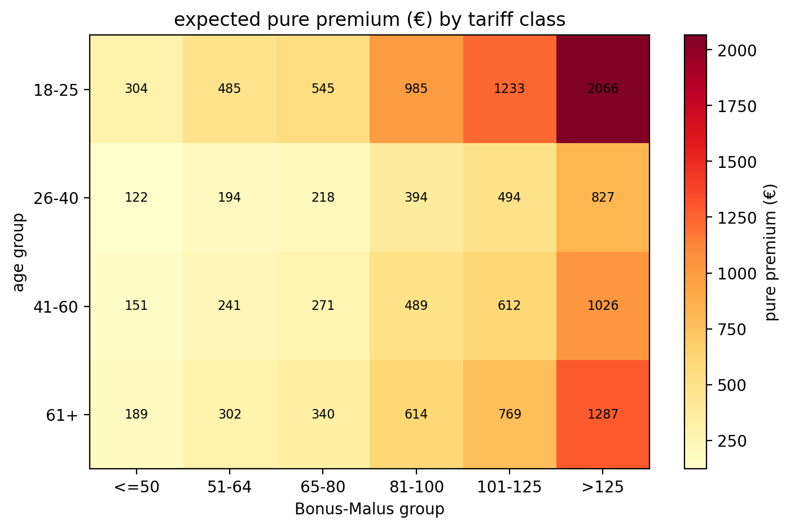

[🇬🇧 English](README.md) | [🇩🇪 Deutsch](README_DE.md)

# Über das Projekt

Dieses Projekt wurde eigenständig im Rahmen eines Selbststudiums in Aktuariat und Versicherungsmathematik nach dem Abschluss meines M.Sc. Mathematik entwickelt.

# Insurance Pricing Analytics – Frequenz- und Schadenhöhenmodellierung mit Python

Ein Portfolio-Projekt, das einen vereinfachten aktuariellen Pricing-Workflow für die Kfz-Haftpflichtversicherung mit Python, SQL und statistischer Modellierung implementiert. Das Projekt folgt dem klassischen aktuariellen Ansatz, Schadenfrequenz und Schadenhöhe getrennt zu modellieren und alternative Severity-Modelle zu validieren.

## Projektüberblick

Dieses Projekt bildet die zentralen Schritte einer aktuariellen Pricing-Analyse nach:

- Datenaufbereitung mit Pandas und SQLite.
- Explorative Analyse eines Versicherungsportfolios und der Schadenhistorie.
- Modellierung der Schadenfrequenz mit einem Poisson-GLM.
- Modellierung der Schadenhöhe mit Gamma- und Lognormal-Modellen.
- Statistische Modellvalidierung und Modellvergleich.
- Ableitung aktuarieller Tarifrelativitäten für Pricing.

Das Projekt folgt der üblichen aktuariellen Trennung in **Frequency** (Wie häufig treten Schäden auf?) und **Severity** (Wie hoch sind die Schäden?).

## Technologien

- Python
- Pandas
- NumPy
- SciPy
- SQLite
- Statsmodels
- Matplotlib
- Seaborn
- VS Code

## Datensatz

Verwendet wird der öffentlich verfügbare Datensatz **French Motor Third-Party Liability (freMTPL2)**.

- `freMTPL2freq.csv` – Policeninformationen, Exposure und Schadenanzahl (678.013 Zeilen, 12 Spalten).
- `freMTPL2sev.csv` – Einzelne Schadenbeträge (26.639 Zeilen, 2 Spalten).

Beide Datensätze werden über die Policen-ID (`IDpol`) zusammengeführt.

## Projektstruktur

```text
insurance-pricing-analytics/
│
├── main.py              # vollständige Analyse Workflow
├── queries.sql          # SQL Befehle für Portfolio Untersuchung
├── insurance.db         # SQLite database aus CSV-Dateien erstellt
├── analyse_plots.pdf    # wichtige Grafiken von verschiedenen Analyse-Abschnitten
├── freMTPL2freq.csv     # Policen und Schadenhäufigkeit - Daten
├── freMTPL2sev.csv      # Schadenbeträge - Daten
├── README_DE.md         # deutsche Version Projektübersicht
└── README.md            # project overview
```

## Modellierung der Schadenfrequenz

Die Schadenfrequenz wird mit einem **Poisson Generalized Linear Model (GLM)** mit Log-Link und `log(Exposure)` als Offset modelliert.

### Tarifmerkmale

- Altersgruppen der Fahrer.
- Bonus-Malus-Gruppen.

Das Modell schätzt die erwartete Anzahl von Schäden pro Police und liefert multiplikative Tarifeffekte für die Frequenzkomponente des Pricings.

## Modellierung der Schadenhöhe

Für die Severity-Analyse werden ausschließlich positive Schadenbeträge betrachtet.

### Explorative Analyse

Die Schadenverteilung weist typische Heavy-Tail-Eigenschaften aus der Versicherungsmathematik auf:

- Stark rechtsschiefe Verteilung.
- Viele kleine Schäden und wenige sehr große Schäden.
- Median ca. 1.172 €.
- Mittelwert ca. 2.279 €.
- Maximale Schadenhöhe über 4 Mio. €.
- Extreme Schäden bleiben bewusst im Datensatz.

### Gamma-GLM (ausgewähltes Modell)

Das finale Severity-Modell ist ein Gamma-GLM mit Log-Link.

**Modellformel**

```text
ClaimAmount ~ age_group + bm_group
```

### Wichtigste Ergebnisse

- Das Fahreralter beeinflusst die erwartete Schadenhöhe statistisch signifikant.
- Bonus-Malus ist im Gamma-Modell statistisch nicht signifikant.
- Das Gamma-Modell reproduziert die durchschnittlichen Schadenhöhen über die Tarifgruppen sehr gut.

### Lognormal-Modell (Benchmark)

Zusätzlich wird ein Lognormal-Modell auf Basis logarithmierter Schadenhöhen geschätzt.

Die Analyse umfasst:

- Interpretation der Koeffizienten.
- Multiplikative Severity-Faktoren.
- Residuenanalyse.
- Q-Q-Plots.
- Vergleich der Vorhersagen auf Euro-Skala mit dem Gamma-Modell.

Das Gamma-Modell liefert die bessere Vorhersage auf der ursprünglichen Schadenbetrags-Skala und wird deshalb als finales Severity-Modell verwendet.

### Modellvalidierung

Die Validierung erfolgt auf Ebene der Tarifgruppen.

#### Gamma-GLM-Kalibrierung

Verglichen werden beobachtete und vorhergesagte durchschnittliche Schadenhöhen für:

- Altersgruppen.
- Bonus-Malus-Gruppen.

#### Validierungskennzahlen

| Kennzahl | Ergebnis |
|----------|----------|
| WMRAE (Altersgruppen) | **1,13 %** |
| WMRAE (Bonus-Malus-Gruppen) | **3,06 %** |
| Deviance / Residual DF | **1,65** |
| Pearson Chi² / Residual DF | **46,99** |

Das Gamma-Modell zeigt eine sehr gute Kalibrierung der durchschnittlichen Schadenhöhe innerhalb der Tarifgruppen. Die Pearson-Dispersion macht gleichzeitig deutlich, dass die Heavy-Tail-Variabilität durch ein einfaches Gamma-Modell nicht vollständig erklärt wird.

## Tarifrelativitäten

Die Severity-Tarifrelativitäten ergeben sich aus den exponentierten Koeffizienten des Gamma-GLM.

### Altersgruppen

| Altersgruppe | Relative Schadenhöhe |
|--------------|---------------------:|
| 18–25 | 1,000 |
| 26–40 | 0,474 |
| 41–60 | 0,408 |
| 61+ | 0,513 |

Die jüngste Fahrergruppe weist die höchste erwartete Schadenhöhe auf.

### Bonus-Malus-Gruppen

| Bonus-Malus | Relative Schadenhöhe |
|-------------|---------------------:|
| ≤50 | 1,000 |
| 51–64 | 1,023 |
| 65–80 | 0,972 |
| 81–100 | 1,243 |
| 101–125 | 0,758 |
| >125 | 1,091 |

Die Bonus-Malus-Effekte werden der Vollständigkeit halber ausgewiesen, sind im ausgewählten Gamma-Modell jedoch statistisch nicht signifikant.

## Pure Premium Berechnung

Die **Pure Premium** kombiniert die erwartete Schadenfrequenz mit der erwarteten Schadenhöhe zu den erwarteten jährlichen Schadenskosten.

**Pure Premium = Erwartete Schadenfrequenz × Erwartete Schadenhöhe**

Die Schadenfrequenz stammt aus dem Poisson-GLM mit `log(Exposure)` als Offset. Dadurch berücksichtigen die Vorhersagen (`freq_pred`) die jeweilige Exposure jeder Police.

Die erwartete Schadenhöhe stammt aus dem ausgewählten Gamma-GLM. Beide Modellvorhersagen werden miteinander multipliziert.

## Pricing-Ergebnisse

Die Pure-Premium-Analyse kombiniert Frequency- und Severity-Modell für alle Kombinationen aus Altersgruppe und Bonus-Malus-Gruppe.

Die resultierende Tarifmatrix enthält **24 Tarifklassen**.

### Wichtigste Ergebnisse

- **Niedrigste Pure Premium:** 26–40 Jahre / BM ≤50 → **121,63 €**
- 41–60 Jahre / BM ≤50 → **150,88 €**
- **Höchste Pure Premium:** 18–25 Jahre / BM >125 → **2.065,53 €**

Die Ergebnisse zeigen einen deutlichen Anstieg der erwarteten Schadenskosten mit steigenden Bonus-Malus-Gruppen. Das Alter beeinflusst sowohl Schadenfrequenz als auch Schadenhöhe, während der Bonus-Malus-Effekt hauptsächlich über das Frequenzmodell wirkt.

## Pure-Premium-Tarifmatrix

Die vollständige Tarifmatrix wird als Heatmap für alle 24 Tarifklassen visualisiert.



Die Heatmap verdeutlicht die Unterschiede zwischen risikoarmen und risikoreichen Tarifklassen.

## Modellvalidierung

Nach der Schätzung der Pricing-Modelle wurde die modellierte Pure Premium mit den tatsächlich beobachteten Schadenskosten des Portfolios verglichen.

### Portfolio-Validierung

| Kennzahl | Ergebnis |
|----------|----------:|
| Beobachtete Schadenskosten pro Exposure | **169,31 €** |
| Modellierte Portfolio-Pure-Premium | **223,34 €** |
| Relativer Portfoliofehler | **31,91 %** |

Die modellierte Pure Premium überschätzt die beobachteten Schadenskosten auf Portfolioebene um rund **31,9 %**. Diese Kennzahl bewertet die Kalibrierung des Gesamtmodells über das gesamte Versicherungsportfolio.

### Validierung der Tarifklassen

Zusätzlich wurden modellierte und beobachtete Pure Premiums für die **24 Tarifklassen** verglichen.

| Kennzahl | Ergebnis |
|----------|----------:|
| Exposure-gewichteter relativer Fehler der Tarifklassen | **49,80 %** |

Diese Kennzahl darf **nicht** als Gesamtmodellfehler interpretiert werden. Einzelne Tarifklassen besitzen sehr unterschiedliche Exposure-Volumina und können durch wenige sehr große Schäden stark beeinflusst werden. Deshalb ist diese Kennzahl deutlich volatiler als die Portfolio-Validierung.

## Interpretation der Ergebnisse

Der Pricing-Workflow bildet sinnvolle Unterschiede zwischen verschiedenen Risikoprofilen ab und zeigt gleichzeitig die Grenzen eines vereinfachten aktuariellen Pricing-Modells.

### Frequency-Modell

Das Poisson-GLM identifiziert Bonus-Malus als den wichtigsten Einflussfaktor auf die Schadenfrequenz.

### Severity-Modell

Das Gamma-GLM erfasst systematische Unterschiede der durchschnittlichen Schadenhöhe zwischen Altersgruppen. Bonus-Malus zeigt im Severity-Modell dagegen keine statistisch signifikanten Effekte.

### Kombiniertes Pricing-Modell

Die Pure Premium kombiniert beide Modellkomponenten. Risikoreiche Tarifklassen erhalten deutlich höhere erwartete jährliche Schadenskosten als risikoarme Tarifklassen.

Gleichzeitig zeigt die Portfolio-Validierung, dass das vereinfachte Modell die beobachteten Schadenskosten noch überschätzt. Das Modell bildet wichtige Pricing-Strukturen ab, erklärt aber die Variabilität des Portfolios noch nicht vollständig.

## Einschränkungen

Dieses Projekt implementiert bewusst einen vereinfachten aktuariellen Pricing-Workflow.

- Es werden nur **Altersgruppe** und **Bonus-Malus-Gruppe** als Tarifmerkmale verwendet.
- Weitere Tarifmerkmale (Fahrzeugtyp, Region, Leistung usw.) werden nicht berücksichtigt.
- Die Schadenverteilung bleibt stark rechtsschief und enthält wenige sehr große Schäden.
- Das Gamma-Modell beschreibt durchschnittliche Schadenhöhen gut, erklärt aber Heavy-Tail-Effekte nicht vollständig.
- Die Portfolio-Validierung zeigt weiterhin einen Kalibrierungsfehler gegenüber den beobachteten Schadenskosten.

Diese Einschränkungen sind für ein kompaktes GLM-Pricing-Modell erwartbar und zeigen Potenzial für weitere Modellverbesserungen.

## Projektstatus

- [x] SQLite-Datenbank und SQL-Exploration.
- [x] Explorative Frequency-Analyse.
- [x] Poisson-GLM für Schadenfrequenz.
- [x] Explorative Severity-Analyse.
- [x] Gamma-GLM.
- [x] Lognormal-Benchmark.
- [x] Gamma-vs.-Lognormal-Vergleich.
- [x] Residuenanalyse.
- [x] Gamma-Modellvalidierung.
- [x] Severity-Tarifrelativitäten.
- [x] Pure-Premium-Berechnung.
- [x] Visualisierung der Tarifmatrix.
- [ ] Analyse des Exposure-Einflusses in Tarifklassen *(in Bearbeitung)*.
- [ ] Pure-Premium-Portfolio-Validierung *(in Bearbeitung)*.
- [ ] Jupyter-Notebook als Präsentationsversion *(in Bearbeitung)*.

## Zentrale Lernergebnisse

Dieses Projekt demonstriert die praktische Umsetzung aktuarieller Pricing-Methoden mit Python:

- Versicherungsdatenaufbereitung mit SQL und Pandas.
- Poisson-GLMs für Schadenfrequenz.
- Gamma-GLMs für Schadenhöhe.
- Vergleich alternativer Severity-Verteilungen.
- Aktuarielle Modellvalidierung mit WMRAE und Tarifgruppen-Kalibrierung.
- Interpretation von GLM-Koeffizienten als Tarifrelativitäten.
- Kombination von Frequency und Severity zur Berechnung einer Pure Premium.

## Geplante Erweiterungen

Das Repository enthält die vollständige Implementierung in `main.py`.

Geplante Erweiterungen:

- Ein strukturiertes Jupyter Notebook als Präsentations- und Dokumentationsversion.
- Erweiterung des Pricing-Modells um zusätzliche Tarifmerkmale aus dem Datensatz.
- Verbesserte Kalibrierung der Pure Premium innerhalb der Tarifklassen.
- Untersuchung alternativer Severity-Verteilungen und weiterer Validierungskennzahlen.

### Zukünftige Arbeiten

Der öffentliche `freMTPL2`-Datensatz enthält keine Informationen zur Schadenentwicklung (Run-off) für Reservierungsverfahren und keine Unternehmensdaten für Solvency-II-Kapitalmodelle.

Diese Themen liegen daher außerhalb des Umfangs dieses Projekts, stellen aber sinnvolle Erweiterungen bei umfangreicheren Versicherungsdatensätzen dar.

## Ausführung des Projekts

### Voraussetzungen

Python 3.8.5 oder neuer.

### Installation

1. Repository klonen:

    git clone https://github.com/Code12chris/insurance-pricing-analytics.git

    cd insurance-pricing-analytics


2. Virtuelle Umgebung erstellen und aktivieren:

    python -m venv venv

    Windows:   venv\Scripts\activate
    Mac/Linux: source venv/bin/activate


3. Abhängigkeiten installieren (`pandas`, `numpy`, `scipy`, `matplotlib`, `statsmodels`, `seaborn`):

    pip install pandas numpy scipy matplotlib statsmodels seaborn

    

4. `python main.py` ausführen.


### Hinweise

- `insurance.db` wird beim ersten Start automatisch erzeugt.
- Alle relevanten Abbildungen werden als PDF exportiert.
- Es ist keine zusätzliche Konfiguration erforderlich.
